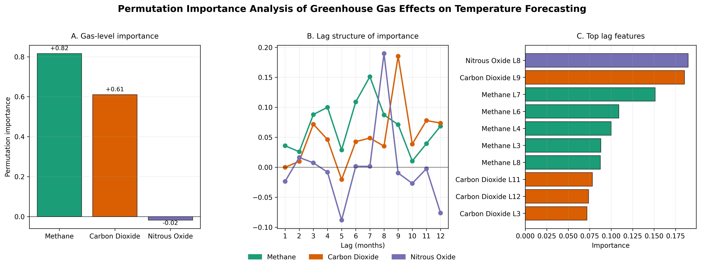

# Common Signals Behind Bots and Fake News Revealed

## Hook
The growing spread of fake news and automated accounts has created widespread confusion about what is real online. Protecting users worldwide requires social media platforms to detect and remove bot-driven content and misinformation before it causes harm.

## Problem Statement
Social media users are constantly exposed to posts, comments, and articles that may contain misleading or false claims. Verifying the accuracy of this information in real time is difficult, allowing misinformation to spread rapidly. This issue is further exacerbated by the growing presence of automated accounts, or bots, which can amplify and accelerate the dissemination of false content. This project aims to examine features indicating the presence of fake news and bots to create robust detection systems.

## Solution Description
The analysis seeks to find related features in both bot detection and fake news detection, in order to create robust systems that can protect users from multiple threats. Utilizing machine learning techniques we found that 9 out of 10 top features in both bot and fake news detection were shared. These features include: the amount of tweets favorited by the user, the average word length of singular tweets, the status count, the normalized influence of the user, the amount of friends the user had, the amount of followers the user has, the number of tweets the user has in lists, the use of capitalization, and the frequency of short words. These shared features are key to creating detection systems that can multi-task to protect users on multiple fronts, thus streamlining the response to fake news and bot-driven content before it causes harm to users.

## Chart

# Methane Emerges as Dominant Predictor in Global Temperature Forecasting Models

## Hook
As the world races to meet climate targets amid rising emissions, understanding which greenhouse gases drive temperature changes most powerfully has never been more critical. New permutation importance analysis reveals unexpected insights about how methane, carbon dioxide, and nitrous oxide differently influence forecasting accuracy over time.

## Problem Statement
Global warming poses an existential threat to ecosystems, economies, and human health worldwide, yet the precise relationship between rising CO2, methane, and nitrous oxide levels and observed temperature changes is not always clearly communicated to policymakers and the public. Climate scientists rely on temperature forecasting models to predict future warming scenarios and inform policy decisions, but the relative contribution of different greenhouse gases to model accuracy remains complex, particularly when considering time-lagged effects across multiple months. Identifying which gases and temporal patterns matter most is essential for building robust predictive systems, setting informed emission reduction goals, allocating resources for climate adaptation, and slowing the pace of global warming.

## Solution Description
Using machine learning permutation importance analysis on monthly atmospheric measurements from 2001 to present, this research quantifies how CO2, methane, and nitrous oxide concentrations predict global temperature anomalies. The analysis reveals that methane dominates temperature forecasting models with an importance score of 0.82, significantly outweighing carbon dioxide at 0.61 and nitrous oxide at just 0.02. When examining temporal lag structure across 12 months, carbon dioxide shows peak importance at 9-month lag (0.19 importance), while nitrous oxide peaks at 8-month lag (0.19 importance), and methane displays sustained predictive power across multiple time horizons from 3 to 8 months. Among the top ten individual lag features, methane dominates with six different lag periods (L3, L4, L6, L7, L8) appearing in the rankings, demonstrating its persistent influence on temperature forecasting accuracy. These findings enable climate scientists to optimize model architectures by focusing computational resources on the most predictive gas measurements and temporal windows, ultimately improving forecast accuracy for climate planning and policy development.

## Visualization
The three-panel analysis demonstrates gas-level importance rankings, temporal lag patterns across 12 months showing how each greenhouse gas contributes to forecasting accuracy over time, and the top ten individual lag features that drive temperature prediction performance.

